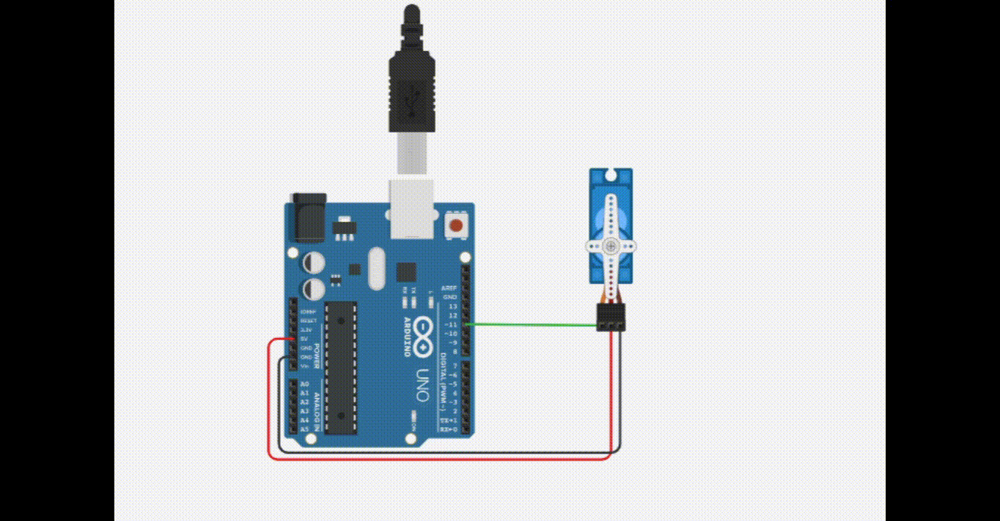

# Semaforo de 3 luzes
 Neste experimento iremos controlar um micro servo na porta PWM 11.  Um micro servo é um motor que possibilita o controle de sua posição utilizado em aeromodelismo ou em projetos mecatrônicos. O servo mais comum é o Micro Servo TowerPro 9g SG90. Iremos mover o servo de 0 a 90 graus aguardando 15 milésimos de segundo, depois de 90 a 180 graus aguardando de 30 milésimos, aguarda um segundo(1000 milésimos), então volta movendo de 180 a 90 graus aguardando 30 milésimos e por fim de 90 a 0 graus aguardando 15 milésimos de segundo.   

 <b><a href="https://www.tinkercad.com/things/cLXrSnBRBrd">Clique Aqui</a></b> para ver o projeto em Tinkercard.com!
 
## Lista de componentes:

- 1  Arduíno UNO R3
- 1  Um cabo de conexão USB
- 3  Resistor de 220 Ω ohms
- 1  Micro Servo TowerPro 9g SG90 
- 3  Jumpers (macho-macho)

## Esquema do projeto

